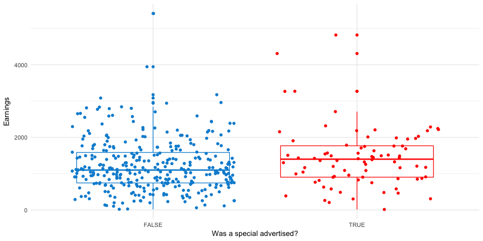

View on [github.io](https://timkiely.github.io/rooftop-bar-rev-vs-weather/)


Effect of Weather on Rooftop Bar Revenues
================

We're interested in the revenues of a rooftop bar in NYC vs the weather on corresponding days. Would heating or covering the roof deck bring in additional revenue?

Data
====

The revenue data was obtained independently directly from a hotel bar. The weather data was scraped from [weatherunderground.com](https://www.wunderground.com/) using the `library(weatherData)` package.

There are many potential "stations" from which to gather weather data. It is important to find not just the most physically proximate station, but also a station with consistent, clean data. Some of the data API functions did not return the correct data. To that end, `getStationCode("New York", region = "NY")` was helpful in retrieving the most reliable station for the NYC area: LGA.

I modified the `getWeatherForYear` function slightly, as the out-of-the-box solution wasn't scraping the API correctly. In addition, I found that scraping the years individually worked, while supplying a range of dates did not. If you wanted to scrape several years of data, one of the `purrr::map()` functions could make that possible.

``` r
getWeatherForYear2 <- 
  function (station_id, year, station_type = "airportCode", opt_detailed = TRUE, 
            opt_write_to_file = FALSE, opt_all_columns = TRUE) 
  {
    if (year == (1900 + as.POSIXlt(Sys.Date())$year)) {
      last_day <- Sys.Date()
    }
    else {
      last_day <- paste0(year, "-12-31")
    }
    first_day <- paste0(year, "-01-01")
    getWeatherForDate(station_id, first_day, last_day, station_type, 
                      opt_detailed, opt_all_columns = opt_all_columns)
  }
```


    ny_2015 <- getWeatherForYear2(station_id="KLGA", year = 2015)
    ny_2016 <- getWeatherForYear2(station_id="KLGA", year = 2016)
    ny_2017 <- getWeatherForYear2(station_id="KLGA", year = 2017)

The data is was concatenated into a single dataframe and written to disk for analysis:

``` r
suppressMessages({
  
  library(tidyverse)
  readr::read_csv("Weather Data/Weather-NYC-2017-05-30.csv", n_max = 5) %>% knitr::kable() 
  
})
```

|  Year| EST      |  Max\_TemperatureF|  Mean\_TemperatureF|  Min\_TemperatureF|  Max\_Dew\_PointF|  MeanDew\_PointF|  Min\_DewpointF|  Max\_Humidity|  Mean\_Humidity|  Min\_Humidity|  Max\_Sea\_Level\_PressureIn|  Mean\_Sea\_Level\_PressureIn|  Min\_Sea\_Level\_PressureIn|  Max\_VisibilityMiles|  Mean\_VisibilityMiles|  Min\_VisibilityMiles|  Max\_Wind\_SpeedMPH|  Mean\_Wind\_SpeedMPH|  Max\_Gust\_SpeedMPH|  PrecipitationIn|  CloudCover| Events    |  WindDirDegrees| Date       | EDT |
|-----:|:---------|------------------:|-------------------:|------------------:|-----------------:|----------------:|---------------:|--------------:|---------------:|--------------:|----------------------------:|-----------------------------:|----------------------------:|---------------------:|----------------------:|---------------------:|--------------------:|---------------------:|--------------------:|----------------:|-----------:|:----------|---------------:|:-----------|:----|
|  2015| 2015-1-1 |                 39|                  33|                 27|                18|               10|               5|             44|              36|             27|                        30.19|                         30.08|                        29.99|                    10|                     10|                    10|                   23|                    14|                   31|             0.00|           1| NA        |             242| 2015-01-01 | NA  |
|  2015| 2015-1-2 |                 42|                  39|                 35|                22|               18|              15|             56|              46|             36|                        30.46|                         30.22|                        30.02|                    10|                     10|                    10|                   25|                    14|                   32|             0.00|           4| NA        |             277| 2015-01-02 | NA  |
|  2015| 2015-1-3 |                 41|                  36|                 31|                40|               29|              19|            100|              75|             50|                        30.60|                         30.44|                        30.09|                    10|                      4|                     1|                   16|                    10|                   20|             0.67|           7| Rain-Snow |              61| 2015-01-03 | NA  |
|  2015| 2015-1-4 |                 57|                  49|                 41|                52|               44|              30|            100|              92|             83|                        30.07|                         29.85|                        29.66|                    10|                      6|                     0|                   30|                    11|                   44|             0.31|           8| Fog-Rain  |             220| 2015-01-04 | NA  |
|  2015| 2015-1-5 |                 50|                  36|                 22|                28|               13|               3|             53|              40|             27|                        30.41|                         30.12|                        29.80|                    10|                     10|                    10|                   32|                    21|                   49|             0.00|           3| NA        |             294| 2015-01-05 | NA  |

EDA
===

For a complete list of EDA plots, run the `03-weather-revenue-EDA.R` script. Among many interesting relationships, the correlation between Temperature and Earnings proved visually appealing. Various nightly specials (many of which could be considered outliers), also proved to be an interesting candidate for the modeling step:

``` r
library(tidyverse)
rev_ts <- read_rds("weather-revenue-data-v002.rds")


# add a 'Specials' indicator and filter for only days with revenues
rev_ts_model <- 
  rev_ts %>% 
  mutate(Special_ind = if_else(is.na(Special),FALSE,TRUE)) %>% 
  filter(Earnings>0) %>% 
  filter(!is.na(Earnings))


# specials indicator ------------------------------------------------------
rev_ts_model %>% ggplot() + 
  aes(x = Earnings, y = Mean_TemperatureF, label = Special) + 
  geom_point(aes(color = Special_ind)) + 
  geom_smooth(method="lm")+
  theme_minimal()+
  ggthemes::scale_color_fivethirtyeight()+
  labs(title = "Do Specials Earn Extra Money?"
       ,y = "Mean Tempurature (F)"
       ,col = "Special?")
```


Modeling
========

Temperature
-----------

Inference is our goal here (rather than predictive capability). For this case, a simple linear model may prove to be the best tool since they are computationally negligible and highly interpret-able.

Let's look at the relationship between `Earnings` and both `Temp` and `Precipitation`

``` r
library(tidyverse)

rev_ts <- read_rds("weather-revenue-data-v002.rds")

rev_ts_model <- 
  rev_ts %>% mutate(Happy_Hour = grepl("Happy Hour",Special)
                    , Special_ind = ifelse(is.na(Special),FALSE,TRUE)
                    , Rain_ind = ifelse(PrecipitationIn>0.5,TRUE,FALSE)
                    , Rain_ind = ifelse(is.na(Rain_ind),FALSE,Rain_ind)
                    , Events = factor(Events)) %>% 
  filter(Earnings>0) %>% 
  filter(!is.na(Earnings))


# modeling temp -----------------------------------------------------------

f4 <- as.formula(Earnings ~ Mean_TemperatureF)

f4_lm <- lm(formula = f4
            , data = rev_ts_model
)
summary(f4_lm)
```

    ## 
    ## Call:
    ## lm(formula = f4, data = rev_ts_model)
    ## 
    ## Residuals:
    ##     Min      1Q  Median      3Q     Max 
    ## -1553.5  -496.4  -162.9   329.4  4657.5 
    ## 
    ## Coefficients:
    ##                   Estimate Std. Error t value Pr(>|t|)    
    ## (Intercept)        -18.370    217.067  -0.085    0.933    
    ## Mean_TemperatureF   18.429      3.075   5.994 4.54e-09 ***
    ## ---
    ## Signif. codes:  0 '***' 0.001 '**' 0.01 '*' 0.05 '.' 0.1 ' ' 1
    ## 
    ## Residual standard error: 714.1 on 404 degrees of freedom
    ## Multiple R-squared:  0.08167,    Adjusted R-squared:  0.07939 
    ## F-statistic: 35.93 on 1 and 404 DF,  p-value: 4.542e-09

With an adjusted R squared of only 0.08, the model accounts for very little of the error in the data. From our EDA above, we can conclude that the relationship between `Temperature` and `Earnings` is not strictly linear. In fact, it appears that when temperatures are too hot, the Earnings go down somewhat, creating a polynomial distribution similar to a parabola, or a rainbow.

Fitting a polynomial model to the data reveals that earnings peak around 75 degrees F, then start to decline. This suggests that days that are too hot are costing the bar money.

``` r
library(modelr)


f4_poly <- as.formula(Earnings ~ poly(Mean_TemperatureF,5))

f4_poly_lm <- lm(formula = f4_poly
                 , data = rev_ts_model %>% filter(Earnings<4000)
)

rev_ts_model %>% 
  data_grid(Mean_TemperatureF) %>% 
  add_predictions(f4_poly_lm) %>% 
  ggplot()+
  aes(x = Mean_TemperatureF, y  = pred) +
  geom_line(color="skyblue", size = 2)+
  geom_point(data=rev_ts_model %>% filter(Earnings<4000), aes(x = Mean_TemperatureF, y = Earnings))+
  geom_vline(aes(xintercept = 75),color = "darkgreen", alpha = 0.5)+
  theme_minimal()+
  ggthemes::scale_color_tableau()+
  labs(title = "Earnings Peak At 75 Degrees"
       , y = "Earnings"
       ,x = "Mean Temperature (degrees F)")
```


``` r
summary(f4_poly_lm)
```

    ## 
    ## Call:
    ## lm(formula = f4_poly, data = rev_ts_model %>% filter(Earnings < 
    ##     4000))
    ## 
    ## Residuals:
    ##     Min      1Q  Median      3Q     Max 
    ## -1349.0  -392.5  -105.5   363.2  2428.0 
    ## 
    ## Coefficients:
    ##                              Estimate Std. Error t value Pr(>|t|)    
    ## (Intercept)                  1238.590     30.836  40.167  < 2e-16 ***
    ## poly(Mean_TemperatureF, 5)1  4532.537    619.029   7.322 1.37e-12 ***
    ## poly(Mean_TemperatureF, 5)2 -3016.531    619.029  -4.873 1.59e-06 ***
    ## poly(Mean_TemperatureF, 5)3 -1510.069    619.029  -2.439   0.0151 *  
    ## poly(Mean_TemperatureF, 5)4    -3.454    619.029  -0.006   0.9956    
    ## poly(Mean_TemperatureF, 5)5   939.349    619.029   1.517   0.1299    
    ## ---
    ## Signif. codes:  0 '***' 0.001 '**' 0.01 '*' 0.05 '.' 0.1 ' ' 1
    ## 
    ## Residual standard error: 619 on 397 degrees of freedom
    ## Multiple R-squared:  0.1774, Adjusted R-squared:  0.167 
    ## F-statistic: 17.12 on 5 and 397 DF,  p-value: 2.406e-15

Rain
----

Rain, on the other hand, seems to have little to no linear relation to Earnings. This is due to the fact that many days have very little precipitation, which may occur in the morning or afternoon (when the bar isn't open). A more robust feature here would be precipitation during operating hours. This could be scraped from the weather data API using `detailed=TRUE` in the call, however, the incremental benefit this would bring us is not worth the effort for this exploratory exercise.

``` r
library(modelr)

# effect of rain on response ----------------------------------------------

f5 <- as.formula(Earnings ~ PrecipitationIn)

f5_lm <- lm(formula = f5
            , data = rev_ts_model
)

rev_ts_model %>% 
  filter(PrecipitationIn>0) %>% 
  data_grid(PrecipitationIn) %>% 
  add_predictions(f5_lm) %>% 
  ggplot()+
  aes(x = PrecipitationIn, y  = pred) +
  geom_line(color="skyblue", size = 2)+
  geom_point(data=rev_ts_model %>% filter(Earnings<4000, PrecipitationIn>0), aes(x = PrecipitationIn, y = Earnings))+
  #geom_vline(aes(xintercept = 75),color = "darkgreen", alpha = 0.5)+
  theme_minimal()+
  ggthemes::scale_color_tableau()+
  labs(y = "Earnings"
       ,x = "Precipitation in inches")
```


``` r
summary(f4_poly_lm)
```

    ## 
    ## Call:
    ## lm(formula = f4_poly, data = rev_ts_model %>% filter(Earnings < 
    ##     4000))
    ## 
    ## Residuals:
    ##     Min      1Q  Median      3Q     Max 
    ## -1349.0  -392.5  -105.5   363.2  2428.0 
    ## 
    ## Coefficients:
    ##                              Estimate Std. Error t value Pr(>|t|)    
    ## (Intercept)                  1238.590     30.836  40.167  < 2e-16 ***
    ## poly(Mean_TemperatureF, 5)1  4532.537    619.029   7.322 1.37e-12 ***
    ## poly(Mean_TemperatureF, 5)2 -3016.531    619.029  -4.873 1.59e-06 ***
    ## poly(Mean_TemperatureF, 5)3 -1510.069    619.029  -2.439   0.0151 *  
    ## poly(Mean_TemperatureF, 5)4    -3.454    619.029  -0.006   0.9956    
    ## poly(Mean_TemperatureF, 5)5   939.349    619.029   1.517   0.1299    
    ## ---
    ## Signif. codes:  0 '***' 0.001 '**' 0.01 '*' 0.05 '.' 0.1 ' ' 1
    ## 
    ## Residual standard error: 619 on 397 degrees of freedom
    ## Multiple R-squared:  0.1774, Adjusted R-squared:  0.167 
    ## F-statistic: 17.12 on 5 and 397 DF,  p-value: 2.406e-15

``` r
summary(f5_lm)
```

    ## 
    ## Call:
    ## lm(formula = f5, data = rev_ts_model)
    ## 
    ## Residuals:
    ##     Min      1Q  Median      3Q     Max 
    ## -1275.7  -538.8  -132.4   405.1  4118.5 
    ## 
    ## Coefficients:
    ##                 Estimate Std. Error t value Pr(>|t|)    
    ## (Intercept)      1294.65      43.52  29.749   <2e-16 ***
    ## PrecipitationIn  -214.71     201.54  -1.065    0.287    
    ## ---
    ## Signif. codes:  0 '***' 0.001 '**' 0.01 '*' 0.05 '.' 0.1 ' ' 1
    ## 
    ## Residual standard error: 764.5 on 344 degrees of freedom
    ##   (60 observations deleted due to missingness)
    ## Multiple R-squared:  0.003288,   Adjusted R-squared:  0.0003908 
    ## F-statistic: 1.135 on 1 and 344 DF,  p-value: 0.2875

Happy Hours
-----------

Finally, let's look at whether advertising a special increases the Earnings in a meaningful way

``` r
rev_ts_model %>% 
  ggplot()+
  aes(x = Special_ind, y = Earnings, color = Special_ind, group = Special_ind)+
  geom_boxplot()+
  geom_jitter()+
  ggthemes::scale_color_fivethirtyeight()+
  theme_minimal()+
  theme(legend.position = "none")+
  labs(x = "Was a special advertised?"
       ,col = NULL)
```



Earnings seem to increase slightly when offers (e.g., Happy Hour specials) are offered. Is this statistically significant? According to our model, there is a weak but statistically significant linear relationship between Specials and Earnings. The model estimates that, all else equal, Specials increase the daily earnings by about $200 on average.

``` r
# effect of advertising a speal on response -------------------------------

f6 <- as.formula(
  Earnings ~ Special_ind
  )

f6_lm <- lm(formula = f6, data = rev_ts_model)
summary(f6_lm)
```

    ## 
    ## Call:
    ## lm(formula = f6, data = rev_ts_model)
    ## 
    ## Residuals:
    ##     Min      1Q  Median      3Q     Max 
    ## -1428.9  -497.2  -112.4   344.6  4191.2 
    ## 
    ## Coefficients:
    ##                 Estimate Std. Error t value Pr(>|t|)    
    ## (Intercept)      1221.91      40.98  29.814   <2e-16 ***
    ## Special_indTRUE   219.96      92.33   2.382   0.0177 *  
    ## ---
    ## Signif. codes:  0 '***' 0.001 '**' 0.01 '*' 0.05 '.' 0.1 ' ' 1
    ## 
    ## Residual standard error: 740 on 404 degrees of freedom
    ## Multiple R-squared:  0.01385,    Adjusted R-squared:  0.01141 
    ## F-statistic: 5.676 on 1 and 404 DF,  p-value: 0.01766

Conclusion
==========

Temperature can be used to effectively model Rooftop Bar Earnings up to a point. The relationship is not linear, however. Earnings tend to peak around 75 degrees (F), then trail off as the air gets warmer. Recommendations to increase revenue might include building an enclosure of some kind to provide both heating and shade which will enable the bar to operate more days out of the year near full capacity.
